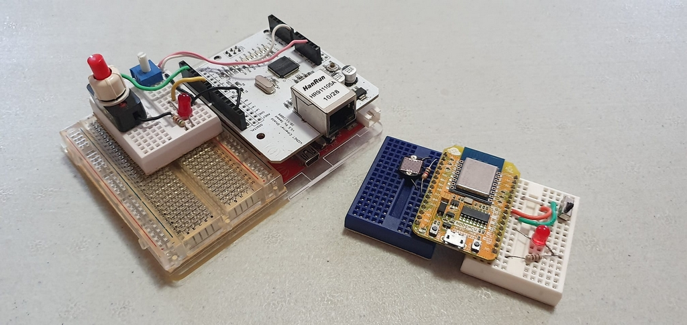

# uSNMP - a small and portable 'C' library for SNMPv1

**uSNMP ("micro-SNMP")** is a small and portable 'C' library for developing SNMPv1 agent and manager. Ports to Arduino IDE, Windows and \*nix are included in the source code, and have been tested on Arduino compatible (AVR ATmega328p) and Arduino Mega with Ethernet Shield, NodeMCU v0.9 (Expressif ESP8266), Windows (compiled with Embarcadero BCC32C C++ compiler) and Cygwin (with gcc).

.

#### How small does uSNMP get?

On an Arduino ATmega328p with an Ethernet Shield, an uSNMP agent that implements the `mib-2::system` table, three minimalist tables of 2 digital inputs (with trap sent when the state toggles), 2 digital outputs and 1 analog input, is about 20kB, inclusive of the SPI, Ethernet, UDP, DNS routines. It supports **Get, GetNext, Set** operations and sends a **Trap** when the digital inputs toggle. The 2kB SRAM limits the number of MIB entries and network packet size (and thus request and response length). By forgoing the `mib-2::system` table, more digital and analog I/O pins can be added to the respective tables. On an Arduino Mega or ESP8266, bigger buffers and more I/O pins can be supported as the SRAM is far bigger.

#### What can uSNMP do?

The library includes functions to store and traverse a MIB tree in lexigraphical order; support callback functions to get and set value of a MIB leaf node, make SNMPv1 **Get, GetNext, Set** request; construct and process the response; create and parse a varbind list, send a **Trap** and takes care of Endianness. 

#### Why use SNMP?

SNMP (Simple Network Management Protocol) is the de-facto standard in IT equipment and well-supported in the industrail and built environment sectors: network equipment, servers and storage, UPS, rectifiers, teleprotection or protection signalling equipment, RTU, remote I/O, etc. Its concept of a Management Information Base (MIB), defined in a text file in ASN.1 notation, is its superpower. MIB files work like a data dictionary or a device description lanaguage. They make it easy to onboard a new device into a SNMP-based management software, of which there are many including open source ones, with features like geographical and topologial map overlay, dashboard, charts, event logs, event action filters, trouble ticketing.

This setup is ideal for IoT applications or asset management, where there are many identical sites and devices with few points. Contrast this with a SCADA/HMI software which is suited for single site with many points, like a process plant or a building, and has more graphical features such as animation.

#### Then, why SNMPv1, and not SNMPv2 or v3?

The SNMP protocol, despite its name, is really not simple to implement nor fit into small processors, even for SNMPv1. What are you losing with SNMPv1 versus v2/v3? Mainly operations for bulk data query and security features. But consider this: a device's MIB can still be traversed fully with SNMPv1 operations. And most, if not all, industrial protocols including dominant ones like Modbus, BACnet and Profinet, do not have built-in or have weak security features. This is not to trivialise security, but to urge pragmatism when circumstances permit. 

#### How does uSNMP work?

The uSNMP library extends the Embedded SNMP Server presented in chapter 8 of the book *"TCP/IP Application Layer Protocols for Embedded Systems"* by **M. Tim Jones** (Charles River Media, 2002. ISBN 1-58450-247-9) who very eloquently wrote

> "... The problem with SNMP message generation is ... forward (unknown) TLV lengths ... The solution chosen for this problem is to parse the SNMP request using a predictive parser and build the response as we go ... We predictively parse through the SNMP PDU, and when we reach the final TLV, we return through our function call chain and update the length values of the TLVs as needed."

#### How do I use uSNMP?

There are code examples of agent and command line utilities that can be used as templates for developing a SNMPv1 agent, to make a SNMPv1 request and process the response, and to send a trap. The example uSNMP agent *usnmpd.c*, for Windows and \*nix, reads OIDs and value pairs from a file, and can be used as a SNMPv1 gateway by having a poller program formats and writes its received data to this file. Another agent example *usnmpd.ino* turns an Arduino board into a SNMP-enabled controller with digital and analog I/O. 

#### Are there MIB files for the example agent?

Yes, they are in the *mibs* directory. The *ARDUINO.MIB* file is for an Arduino Software (IDE) managed board, and the Private Enterprise Number (PEN) is 38644 of [Armadino](http://www.armadino.com)

#### How do I send a trap?

See the example programs *usnmpd.ino* and *usnmptrap.c*. The varbind list may optionally be parsed so that varbind pair with NULL data will be filled in by the callback function, much like a Get operation.

#### What's the difference between the Arduino and \*nix/Windows ports?

In a nuthell, Socket API and SRAM size. The limited SRAM poses a limit on the data buffer size and the number of entries in the MIB tree. See *usnmp.h* and the agent examples *usnmpd.c* and *usnmpd.ino*.

#### How may I port uSNMP to another microcontroller or OS?

Platform specific issues are network packet size and data buffer size. These are defined in the file *usnmp.h*. Socket API in *SnmpAgent.c* and *SnmpMgr.c* may have to be modified. You should not have to worry about Endianness since the uSNMP library deals with it.

#### Why is the uSNMP library written in 'C', not 'C++'?

'C' has been and is widely used in embedded systems development. Being in 'C' makes uSNMP more adaptable to past, present and future projects. As seen in the Arduino port and example, it could work in a C++ environment. 

#### Any caveat?

1. It's not a concurrent agent - it processes SNMP requests one at a time.
2. Nor is it re-entrant. For instance, do not attempt to send a trap within the callback functions, as the response packet buffer is also used as a temporary space to construct the trap packet in order to conserve RAM space. Instead, send the trap in the main program loop.
3. Does not support arbitrary OID, i.e. all OID strings must start with one of three prefixes:
     'B' denotes `mgmt:mib2 - 1.3.6.1.2.1`
     'E' for `experimental - 1.3.6.1.3`
     'P' for `private:enterprises - 1.3.6.1.4.1` 
   e.g. `mib-2::sysDescr.0` is `B.1.1.0`
4. BER-encoded OID not to exceed 127 bytes.
5. On some systems where an integer is 16-bit, such as the Arduino UNO, none of the dotted decimal in an OID should exceed 65535. 

#### Does uSNMP support multiplexing with community string?

Yes, you may set a callback function to process the requestor's community string, which can in turn be mapped to a device name. This feature is useful for constructing a gateway to receive and translate data from multiple non-SNMP sources.

#### How do I get started?

See [README_Build.md](README_Build.md)

#### License

uSNMP is released under a BSD-style license. See [License.txt](License.txt)

#### Acknowledgments

* [M. Tim Jones](http://www.mtjones.com)
