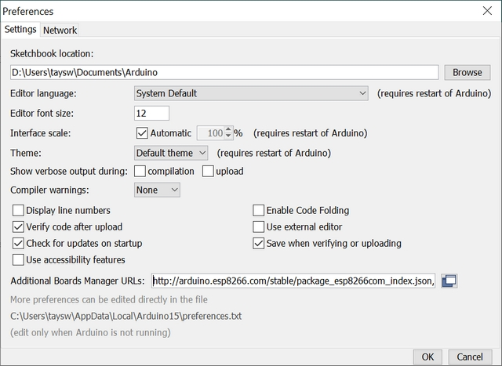
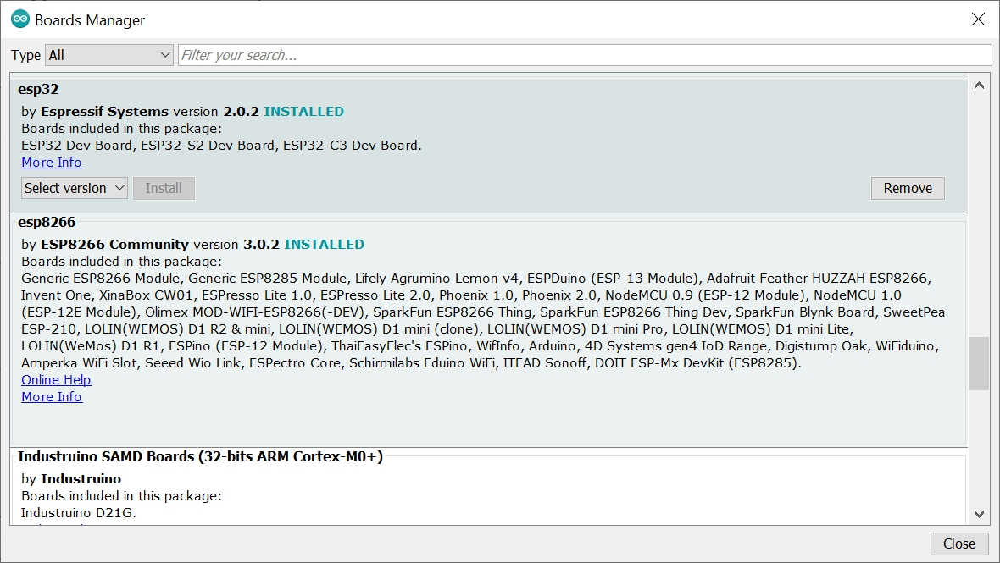
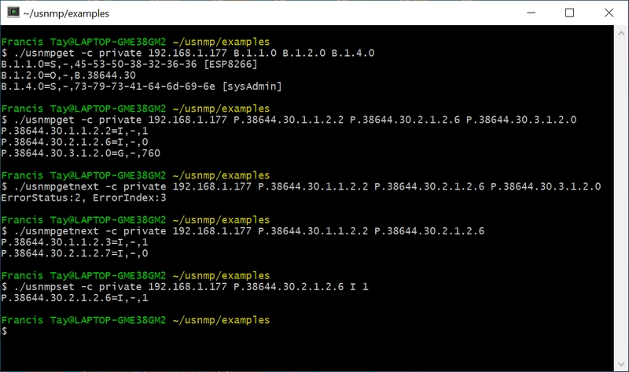
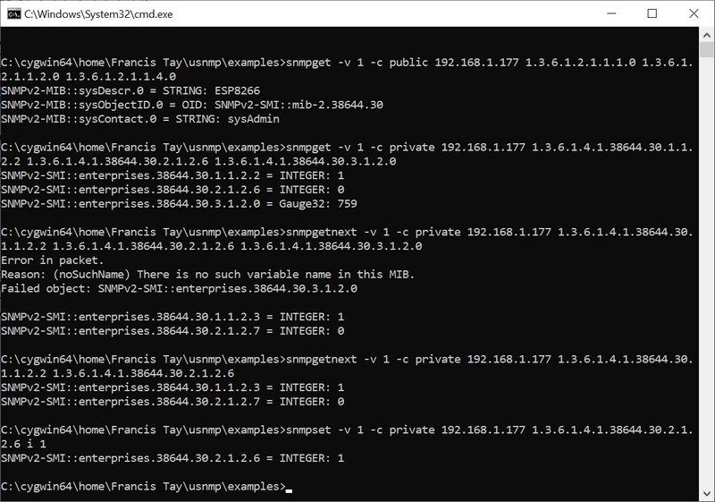

## uSNMP - a small and portable 'C' library for SNMP v1

*This article is an introduction to the uSNMP library and shows how to use it to enable low-cost hardware to leverage the power of SNMP for IoT and asset monitoring projects.*

**uSNMP ("micro-SNMP")** is a small and portable 'C' library for developing SNMP v1 agent and manager. Ports to Arduino IDE, Windows and \*nix are included in the source code, and have been tested on Arduino compatible (AVR ATmega328p) and Arduino Mega with Ethernet Shield, NodeMCU v0.9 (Expressif ESP8266), ESP32, Windows (compiled with Embarcadero BCC32C C++ compiler) and Cygwin (with gcc).

#### How small does uSNMP get?

On an Arduino ATmega328p with an Ethernet Shield, an uSNMP agent that implements the `mib-2::system` table, three minimalist tables of 2 digital inputs (with trap sent when the state toggles), 2 digital outputs and 1 analog input, is about 20kB, inclusive of the SPI, Ethernet, UDP, DNS routines. It supports `Get, GetNext, Set` operations and sends a `Trap` when any of the digital inputs toggles. The 2kB SRAM limits the number of MIB entries and network packet size (and thus request and response length). By forgoing the `mib-2::system` table, more digital and analog I/O pins can be added to the respective tables. On an Arduino Mega, ESP8266 or ESP32, bigger packet buffers and more I/O pins can be supported as the SRAM is far bigger.

#### What can uSNMP do?

The library includes functions to store and traverse a MIB tree in lexigraphical order; support callback functions to get and set value of a MIB leaf node, make `Get, GetNext, Set` request; construct and process the response; create and parse a varbind list, send a `Trap` and takes care of Endianness. 

#### Why use SNMP?

SNMP (Simple Network Management Protocol) is the de-facto standard in IT equipment and well-supported in the industrial and built environment sectors: network equipment, servers and storage, UPS, rectifiers, teleprotection or protection signalling equipment, RTU, remote I/O, etc. Its concept of a Management Information Base (MIB), defined in a text file in ASN.1 notation, is its superpower.

A MIB file works like a data dictionary or a device description lanaguage. It is very easy to onboard a new device into a SNMP-based management software, of which there are many including open source ones, with features like geographical and topologial map overlay, dashboard, charts, event logs, event action filters, trouble ticketing.

This setup is ideal for IoT applications or asset management, where there are many identical sites and devices with few points. Contrast this with a SCADA/HMI software which is suited for single site with many points, like a process plant or a building, and has more visualisation features such as 3D and animation.

#### Why SNMP v1, and not v2 or v3?

The SNMP protocol, despite its name, is really not simple to implement nor fit into small processors, even for SNMP v1. What are you losing with SNMP v1 versus v2/v3? Mainly operations for bulk data query and security features. But consider this: a device's MIB can still be traversed fully with SNMP v1 operations. And most, if not all, industrial protocols including dominant ones like Modbus, BACnet and Profinet, do not have built-in or have weak security features. This is not to trivialise security, but to urge pragmatism when circumstances permit. 

#### How does uSNMP work?

The uSNMP library extends the Embedded SNMP Agent presented in chapter 8 of the book *"TCP/IP Application Layer Protocols for Embedded Systems"* by **M. Tim Jones** (Charles River Media, 2002. ISBN 1-58450-247-9) who very eloquently wrote

> "... The problem with SNMP message generation is ... forward (unknown) TLV lengths ... The solution chosen for this problem is to parse the SNMP request using a predictive parser and build the response as we go ... We predictively parse through the SNMP PDU, and when we reach the final TLV, we return through our function call chain and update the length values of the TLVs as needed."

#### How do I use uSNMP?

There are code examples of agent and command line utilities that can be used as templates for developing a SNMP v1 agent, to make a SNMP v1 request and process the response, and to send a trap.

The example uSNMP agent *usnmpd.c*, for Windows and \*nix, reads OIDs and value pairs from a file, and can be used as a SNMP v1 gateway by having a poller program formats and writes its received data to this file.

Another agent example *usnmpd.ino* turns an Arduino board into a SNMP-enabled controller with digital and analog I/O.
MIB files are in the *mibs* directory. The *ARDUINO.MIB* file is for an Arduino Software (IDE) managed board, and the Private Enterprise Number (PEN) is 38644 of [Armadino](http://www.armadino.com)


*Test circuits on an Arduino ATmega328p and NodeMCU v0.9: DI on pin D2, DO on D6, AI on A0.*

#### usnmpd.ino - A SNMP Agent for Arduino

Let's take a deeper look into usnmpd.ino. For 3rd party hardware packages such as NodeMCU and ESP32, it is first necessary to add the URL of their Boards Manager JSON file in the Arduino IDE. The URLs point to JSON index files that Arduino IDE uses to build the list of available installed boards. This may be done from **File > Preferences** and for ESP8266 boards like NodeMCU:


*Import ESP8266 package to Arduino IDE.*

Then go to the **Tools > Board > Boards Manager** and install the package


*Install ESP8266 package to Arduino IDE.*

#### setup()

The first few lines of *usnmpd.ino* sets up the network connection (Ethernet or WiFi), IP address and agent configuration.

```c
// Agent's IP configuration. Retain these global variable names.
IPAddress hostIpAddr( 192, 168, 1, 177 ),
    dnsServer( 192, 168, 1, 1 ),
    hostGateway( 192, 168, 1, 1 ),
    hostNetmask( 255, 255, 255, 0 );
#ifdef ARDUINO_ETHERNET
unsigned char hostMacAddr[] = { 0xDE, 0xAD, 0xBE, 0xEF, 0xFE, 0xED };
#else // assume ARDUINO_WIFI
char staSSID[] = "Wifi_SSID";
char staPSK[] = "Wifi_Password";
#endif

// SNMP agent configuration.
#define ENTERPRISE_OID  "P.38644.30"  // used as sysObjectID and in trap
#define RO_COMMUNITY    "public"                  
#define RW_COMMUNITY    "private"
#define TRAP_DST_ADDR   "192.168.1.170"
```

uSNMP defines three prefixes for Object ID that every valid OID is required to start with:

```
B denotes Mgmt-Mib2 - 1.3.6.1.2.1
E denotes Experimental - 1.3.6.1.3
P denotes Private-Enterprises - 1.3.6.1.4.1
```

Thus, `sysDescr.0 (1.3.6.1.2.1.1.1.0)` will be coded as "B.1.1.0" and the Enterprise OID of `1.3.6.1.4.1.38644.30` as "P.38644.30".

`setup()` initialise the board and agent 'engine', including constructing the MIB tree, and sending a coldStart trap. Pins D2 to D5 are designated as digital inputs, D6 to D8 are digital outputs, and A0 and A1 are analog inputs, depending on the amount of SRAM available on the target microcontroller. Having included the `mib-2::system` table, an Arduino UNO with ATmega328p could have D2, D3, D6, D7 and A0, while a Arduino Mega may go beyond D5, D8 and A1 if one so wishes. Otherwise, omitting the system table will free up space on an UNO for more pins.

```c
initSnmpAgent(SNMP_PORT, ENTERPRISE_OID, RO_COMMUNITY, RW_COMMUNITY);
initMibTree();
trapBuild(&request, enterpriseOID, hostIpAddr, COLD_START, 0, NULL); // cold start trap
trapSend(&request, trapDstAddr, TRAP_DST_PORT, roCommunity);
```

The MIB tree is constructed with the `miblistadd()` function, that grafts a MIB leave node onto it in lexigraphical order. If needed, this is followed by setting the node's value, and attaching callback functions to respond to SNMP **Get** and **Set** operations. In the extract below, `sysDescr.0` is assigned a character string that already holds the system description. `sysObjectID.0` is initialised with the EnterpriseOID after it has been encoded with BER (Basic Encoding Rule). `sysUpTime.0` is set up with `get_uptime()` callback to fill in the system uptime whenever a **Get** operation is asked.

```c
/* System MIB */

// sysDescr Entry
thismib = miblistadd(mibTree, "B.1.1.0", OCTET_STRING, RD_ONLY,
    sysDescr, strlen(sysDescr));

// sysObjectID Entry
thismib = miblistadd(mibTree, "B.1.2.0", OBJECT_IDENTIFIER, RD_ONLY,
    entOIDBer, 0);  // set length to 0 first
i = str2ber(enterpriseOID, entOIDBer);
mibsetvalue(thismib, (void *) entOIDBer, (int) i);  // proper length set

// sysUptime Entry
thismib = miblistadd(mibTree, "B.1.3.0", TIMETICKS, RD_ONLY, NULL, 0);
i = 0; mibsetvalue(thismib, &i, 0);
mibsetcallback(thismib, get_uptime, NULL);
```

The digital and analog I/O pins are presented in SNMP tables. To save memory, these tables are minimalist, comprising only an index and the pin value. Callback functions are required so that the values are retieved just-in-time when responding to a **Get** or **Set** request. Thus, for digital output D6, for instance:

```c
// Digital output #6 index
thismib = miblistadd(mibTree, "P.38644.30.2.1.1.6", INTEGER, RD_ONLY, NULL, 0);
i = 6; mibsetvalue(thismib, &i, 0);
// The value of Digital #6
thismib = miblistadd(mibTree, "P.38644.30.2.1.2.6", INTEGER, RD_WR, NULL, 0);
i = 0; mibsetvalue(thismib, &i, 0);
mibsetcallback(thismib, get_dio, set_dio);
```

#### loop()

The agent will send a trap whenever it detects a change of state in a digital input. As the uSNMP agent is not re-entrant, trap should only be built and send in the main loop.

```c
if ( x & 0x01 ) {
    vblistReset(&response); dInIndex[17]='0'+y; // use response buffer to build trap
    if ( lastDIN & 0x01 ) {                     // input pin y was 1
        i = 0;                                  // it is thus 0 now
        vblistAdd(&response, dInIndex, INTEGER, &i, 0);
        trapBuild(&request, enterpriseOID, hostIpAddr, 
                  ENTERPRISE_SPECIFIC, 1, &response);
    }
    else {
        i = 1;
        vblistAdd(&response, dInIndex, INTEGER, &i, 0);
        trapBuild(&request, enterpriseOID, hostIpAddr, 
                  ENTERPRISE_SPECIFIC, 2, &response);
    }
    trapSend(&request, trapDstAddr, TRAP_DST_PORT, rwCommunity);
}
```

Likewise, if the agent encounters a mismatched community string in processing a SNMP request, it sends an Authentication Failure trap.

```c
if ( processSNMP() == COMM_STR_MISMATCH ) {
    trapBuild(&request, enterpriseOID, hostIpAddr, AUTHENTICATE_FAIL, 0, NULL);
    trapSend(&request, trapDstAddr, TRAP_DST_PORT, rwCommunity);
}
```

#### Test Results

That's just about it. The uSNMP library has functions to make SNMP request and process response; and includes command line examples such as *usnmpget* and *usnmpset* which are used to test the *usnmpd.ino agent*. The alternative is to use the [Net-SNMP](http://www.net-snmp.com) binaries. Both set of tests are showed below:


*Tested with uSNMP utilities.*


*Tested with Net-SNMP utilities.*

#### FAQ

##### How do I send a trap?

See the example programs *usnmpd.ino* and *usnmptrap.c*. The varbind list may optionally be parsed so that varbind pair with NULL data will be filled in by the callback function, much like a Get operation.

##### What's the difference between the Arduino and \*nix/Windows ports?

In a nuthell, Socket API and SRAM size. The limited SRAM poses a limit on the data buffer size and the number of entries in the MIB tree. See *usnmp.h* and the agent examples *usnmpd.c* and *usnmpd.ino*.

##### How may I port uSNMP to another microcontroller or OS?

Platform specific issues are network packet size and data buffer size. These are defined in the file *usnmp.h*. Socket API in *SnmpAgent.c* and *SnmpMgr.c* may have to be modified. You should not have to worry about Endianness since the uSNMP library has dealt with it.

##### Why is the uSNMP library written in 'C', not 'C++'?

'C' has been and is widely used in embedded systems development. Being in 'C' makes uSNMP more adaptable to past, present and future projects. As seen in the Arduino port and example, it works in a C++ environment. 

##### Any caveat?

1. It's not a concurrent agent - it processes SNMP requests one at a time.
2. Nor is it re-entrant. For instance, do not attempt to send a trap within a callback function, as the response packet buffer is also used as a temporary space to construct the trap packet in order to conserve RAM space. Instead, send the trap in the main program loop.
3. Does not support arbitrary OID, i.e. all OID strings must start with one of three prefixes:
     'B' denotes `mgmt:mib2 - 1.3.6.1.2.1`
     'E' for `experimental - 1.3.6.1.3`
     'P' for `private:enterprises - 1.3.6.1.4.1` 
   e.g. `mib-2::sysDescr.0` is `B.1.1.0`
4. BER-encoded OID not to exceed 127 bytes. This should not normally be a problem as it takes an usually long OID to exceed it. 
5. On some systems where an integer is 16-bit, such as the Arduino UNO, none of the dotted decimal in an OID should exceed 65535. 

##### Does uSNMP support multiplexing with community string?

Yes, you may set a callback function to process the requestor's community string, which can in turn be mapped to a device name. This feature is useful for constructing a gateway to receive and translate data from multiple non-SNMP sources.

##### How do I get started?

See [README_Build.md](README_Build.md)

#### License

uSNMP is released under a BSD-style license. See [LICENSE](LICENSE)

#### Acknowledgments

* [M. Tim Jones](http://www.mtjones.com)
